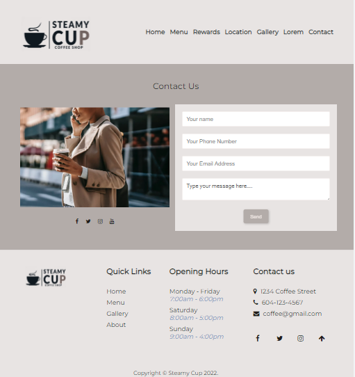

<h2 align="center">
Steamy Cup  
</h2>

<h3 align="center">For my final project I created a web application called Steamy Cup.</h3>

My final project utilizes the technologies covered in BCIT comp 1850.

The website includes:
1 – A clear topic that is clearly described on the homepage
2 – 6 or more HTML pages interlinked
3 – Minimum 5 pages of actual content authored by you, 1 page where content is the lorem ipsum HTML provided with these specifications
4 – Responsiveness to clients of all kinds (between 300px – 1920px width viewports)
5 – Font icons. Eg: social media links, or shopping cart checkout. Link/icons do not need to be functional
6 – Font server or @font-face must be used for all font family(s)
7 – At least 5 images
8 – At least one example of: table, ul, ol, blockquote elements
9 – An HTML form (no processing script is required)
10 – At least one JavaScript feature (client side)

    

 
    

    

    

    

## Built With

Steamy Cup was built using these technologies:

- HTML
- CSS
- JavaScript

